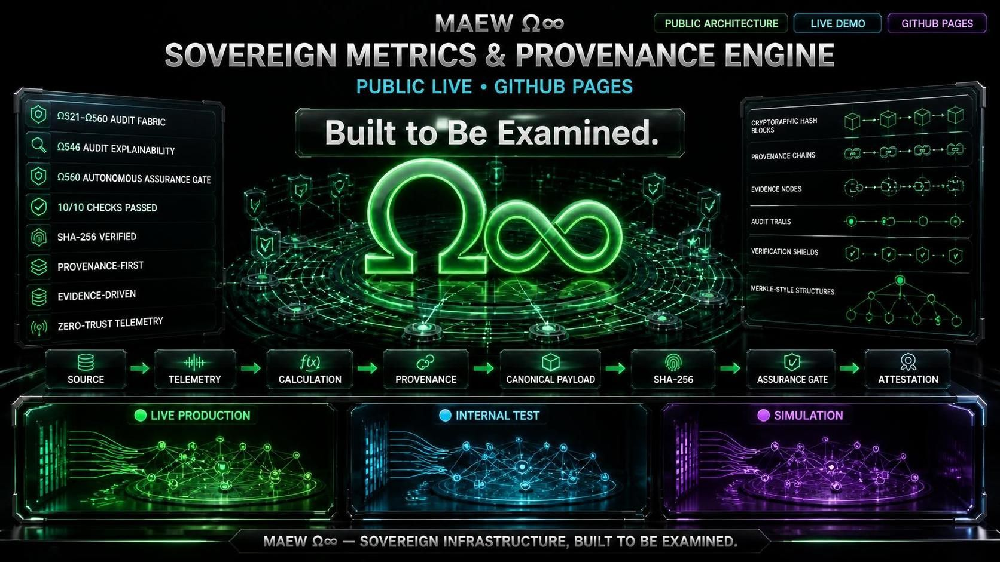
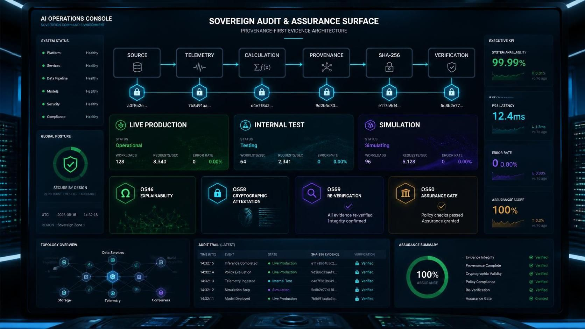

# MAEW Ω∞ Sovereign Metrics & Provenance Engine

[](docs/architecture.md)
[](docs/assurance-gates.md)
[](https://hugeplease66-debug.github.io/maew-sovereign-metrics/)

> **«Built to Be Examined.»**
> A provenance-first, evidence-driven autonomous audit console demonstrating zero-trust telemetry verification, semantic state isolation, and cryptographic assurance.

---

## 🖼️ Canonical Visual SSoT

<!-- 1. Hero Header Banner -->


<!-- 2. AI Operations & Assurance Console -->


---

## 🚀 LIVE DEMO

### 🌐 Launch the Sovereign Metrics Console

**[▶ Open MAEW Ω∞ Live Demo](https://hugeplease66-debug.github.io/maew-sovereign-metrics/)**

Interactive single-page demonstration of the MAEW Ω∞ Sovereign Metrics & Provenance Engine.

---

## 📚 Documentation

- 🔐 [System Architecture Overview](docs/architecture.md)
- 🛡️ [Ω560 Assurance Gate Matrix Specification](docs/assurance-gates.md)
- 🧬 [Ω546 Audit Explainability Specification](docs/provenance.md)
- 📊 [Demo & UI Layer Status Specification](docs/demo-status.md)

---

## 🏛️ ARCHITECTURAL PIPELINE

MAEW Ω∞ establishes an independent verification boundary between telemetry producers and executive reporting layers.

```text
SOURCE
   ↓
TELEMETRY
   ↓
CALCULATION
   ↓
PROVENANCE
   ↓
CANONICAL PAYLOAD
   ↓
SHA-256
   ↓
Ω560 ASSURANCE GATE
   ↓
ATTESTATION
   ↓
EXECUTIVE REPORTING
```

---

## 🧬 CORE ARCHITECTURE CAPABILITIES

### 🟢 Semantic State Separation

Strictly isolates execution domains:

- 🟢 LIVE PRODUCTION
- 🔵 INTERNAL TEST
- 🟣 SIMULATION

> «No semantic state is implicitly promoted across verification boundaries.»

### 🧬 Ω546 Audit Explainability

| Dimension | Question |
| :--- | :--- |
| 01 | What changed? |
| 02 | When was it observed? |
| 03 | Where did it originate? |
| 04 | What is the source identity? |
| 05 | Why did the value change? |
| 06 | What is the confidence impact? |
| 07 | Who/what authorized the ingestion? |
| 08 | Was the payload tampered with? |

### 🛡️ Ω560 AUTONOMOUS ASSURANCE GATE

1. Source Integrity
2. Payload Integrity
3. Schema Integrity
4. Provenance Chain Link
5. Calculation Replay
6. Policy Compliance
7. No Silent Deletion
8. No Unsealed Change
9. Cross-Region Consistency
10. Cryptographic Seal Lock

```text
10 / 10 CHECKS PASSED
        ↓
   Ω560 VERIFIED
```

---

## ✨ HIGHLIGHTS & INCLUDED FEATURES

- **Navigation Shell** — Full interactive navigation across:
  - `01` — Command Center
  - `02` — Cognitive Mesh
  - `03` — FinOps Controller
  - `04` — Sovereign Audit & Assurance Surface
- **Interactive SVG Topology** — Clickable nodes with real-time state inspection and visual feedback.
- **Terminal Simulation** — Functional command-execution logger with an output viewport.
- **Attestation Export** — JSON attestation receipt export: `attestation_receipt_demo.json`
- **Sovereign Passport Modal** — Trust-passport detail overlay for inspecting assurance, provenance, and verification state.

---

## 🧪 INTERACTIVE TAMPER & DRIFT SIMULATOR

```text
48.2 PFLOPS - Confidence: 99.9% - Status: Ω560 PASSED
        ↓ TAMPERED TO ↓
999,999 PFLOPS - Confidence: 0.0% - Status: BLOCKED
```

The simulator demonstrates that a materially altered metric cannot silently pass the verification boundary.

---

## 🔐 CRYPTOGRAPHIC PROVENANCE

```json
{
  "metric_id": "compute_power",
  "value": "48.2 PFLOPS",
  "semantic_state": "observed",
  "tamper_status": "UNMODIFIED"
}
```

---

## 📂 REPOSITORY STRUCTURE

```text
maew-sovereign-metrics/
├── index.html
├── README.md
├── banner.jpg                          # 🟢 Hero Header Banner - Canonical
├── sovereign-audit-console.jpg         # ⚫ AI Operations Console - Canonical
└── docs/
    ├── architecture.md
    ├── assurance-gates.md
    ├── provenance.md
    └── demo-status.md
```

---

## 🛑 TRUST BOUNDARY & DISCLAIMER

> **DEMO & UI LAYER MODE:** Synthetic data only.
> No production credentials, API secrets, or private infrastructure are exposed.
> SHA-256 integrity verification is performed client-side using the Web Crypto API.

---

## 💻 LOCAL EXECUTION

```bash
git clone https://github.com/hugeplease66-debug/maew-sovereign-metrics.git
cd maew-sovereign-metrics
python3 -m http.server 8080
```

Open: http://localhost:8080

**Live Demo:** https://hugeplease66-debug.github.io/maew-sovereign-metrics/

---

## 🐉 MAEW Ω∞

> «Observe. Preserve Provenance. Verify. Explain. Attest.»

<p align="center">
  <strong>MAEW Ω∞ Sovereign Metrics</strong><br>
  Provenance-First • Evidence-Driven • Audit-Ready
</p>
